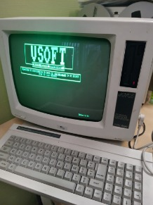

# 1985: MAR Accounting for Schneider JOYCE/Amstrad PCW

[SHOW DUTCH BELGIAN PCW-ADVERT FROM NOVEMBER 1985][DIDECAR]

## Vsoft MAR Accounting 1985-1987

An accounting program, written in Mallard BASIC using the B+ Tree data sorting functionality for the Amstrad PCW (Schneider JOYCE) with CPM 3. The program is written for the Belgian market and uses Dutch language.

A ready to run version is prepared as program startup disk for drive B. Also 2 data disks are available. All files available in the .dsks folder. Use the CF2DD files only for B: (720 KB)!

The Mallard BASIC source code is not protected and can be used for your own purposes.

Manual can be found in [doc folder][Manual] in pdf file format.

## CPM Box Emulator

### [Habisoft][habisoft]

A free emulator on Windows for the Amstrad PCW (Schneider JOYCE) computer.

### [System Discs][systemdiscs]

## Links to other resources

- [Wikipedia][wikipedia] - Amstrad PCW
- [Amstrad PCW Wiki][pcw-wiki]

[DIDECAR]: images/DIDECAR-JOYCE-PCW-ADVERT-DEC1985.pdf
[Manual]: doc/VSOFT-MAR-PCW-1987-NL.pdf
[habisoft]: https://habisoft.com/pcw/en.htm
[systemdiscs]: https://www.habisoft.com/pcwwiki/doku.php?id=en:sistema:indice
[pcw-wiki]: https://www.habisoft.com/pcwwiki/doku.php?id=en:start
[wikipedia]: https://en.wikipedia.org/wiki/Amstrad_PCW
